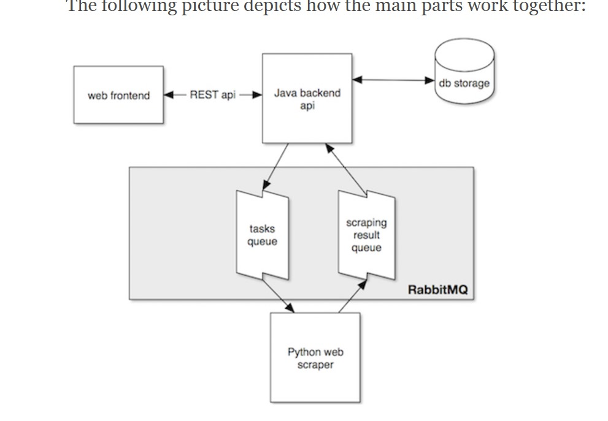

<h1>Hello !!</h1>

    <h2>Project Overview</h2>
    

        <dl>
            <dt><strong>Design Application:</strong></dt>
            <dd></dd>
        </dl>
        

        <dl>
            <dt>Build Application: </dt>
            <dd>
                <table>
                    <tr>
                        <td width="400"><strong></strong></td>
                        <td width="400"><strong></strong></td>
                    </tr>
                </table>
            </dd>
        </dl>
 

    

    <h2>Project Architecture</h2>
    <a href="https://bernhardwenzel.com/articles/tutorial-build-a-message-driven-microservice-application/">Inspiration :</a>
    <tr>
        <td></td>
    </tr>     

<h3>this is a my final step about intauring spring security layer using jwt as show below</h3>

    
Authentication is done using jwt token

    

    
Users registered are persisted within mongoDB database

    

