<h1>Hello !!</h1>

    <h2>Project Overview</h2>
    

        <dl>
            <dt><strong>Design Application:</strong></dt>
            <dd>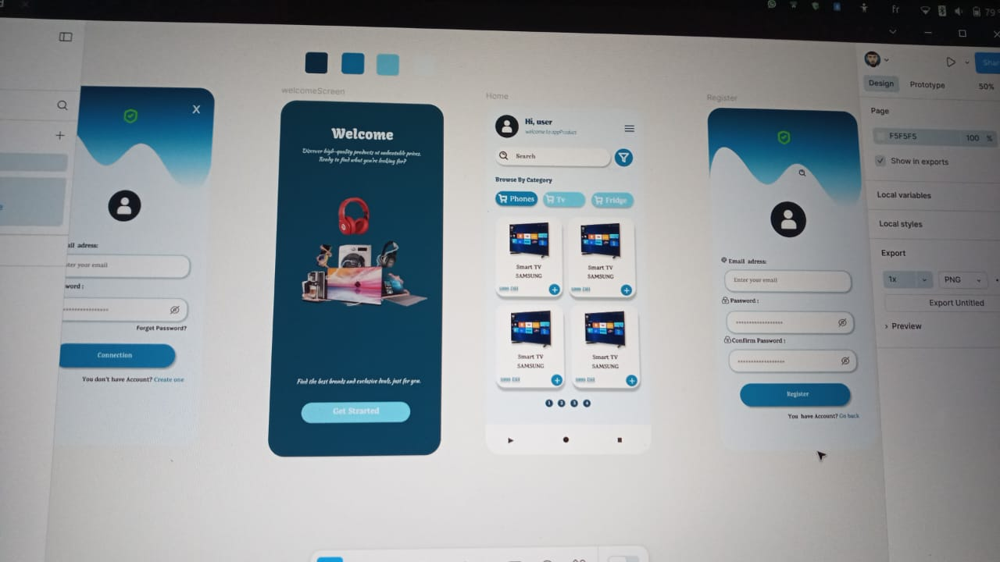</dd>
        </dl>
        

        <dl>
            <dt>Build Application: </dt>
            <dd>
                <table>
                    <tr>
                        <td width="400"><strong>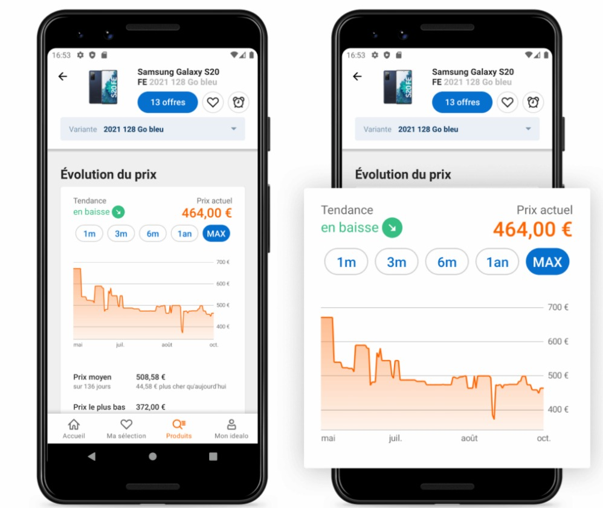</strong></td>
                        <td width="400"><strong></strong></td>
                    </tr>
                </table>
            </dd>
        </dl>
 

    

    

    

    <h2>Project Architecture</h2>
    <a href="https://bernhardwenzel.com/articles/tutorial-build-a-message-driven-microservice-application/">Inspiration :</a>
    <tr>
        <td>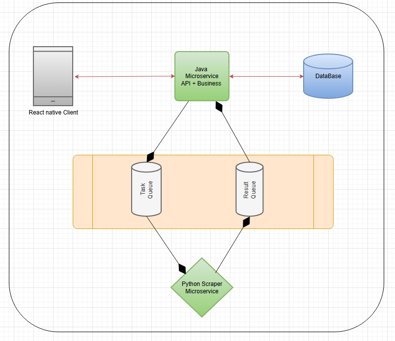</td>
    </tr>     

<h2>JWT Implementation</h2>

this is a my final step about intauring spring security layer using jwt as show below

    <dl>
        <dt>Registeration : </dt>
        <dd>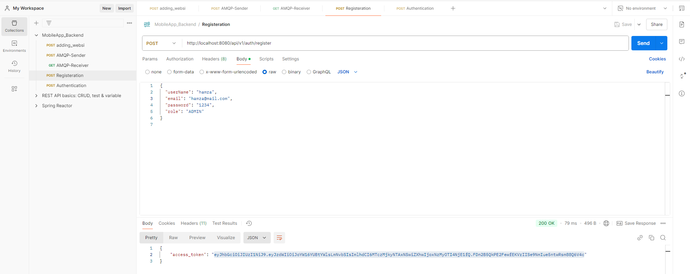</dd>
    </dl>

    <dl>
        <dt>Authentication : </dt>
        <i>authentication using jwt token : </i>
        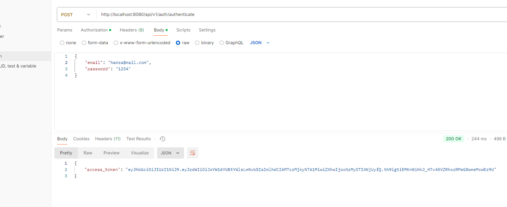
    </dl>

    

    

<h2>AMQP Controller Implementation </h2>

<dl>
        <dt>I-Authenticate : to get fresh jwt token</dt>
        <dd>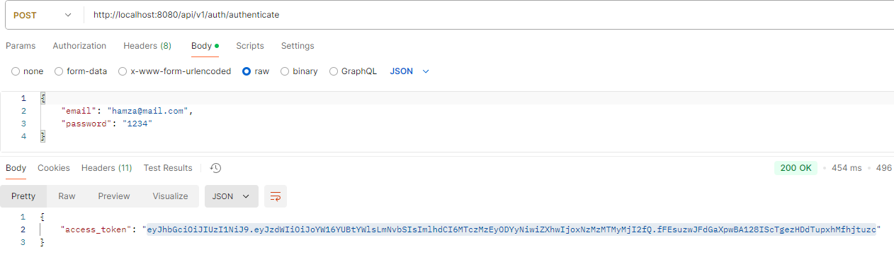</dd>
    </dl> 

    <dl>
        <dt>II-Start the Rabbit MQ instance : </dt>
        <dd>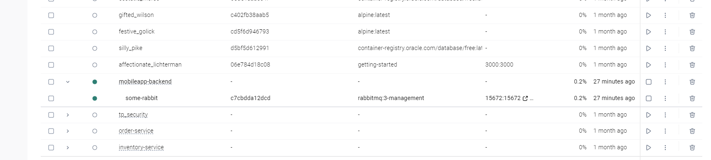</dd>
    </dl>

    <dl> <strong>III-</strong>
        
<ol>
<li>
<dt>Consumme AMQP API Sender : </dt>
        <i>We have to consume the api with a jwt authentication alive token</i>
        <dd>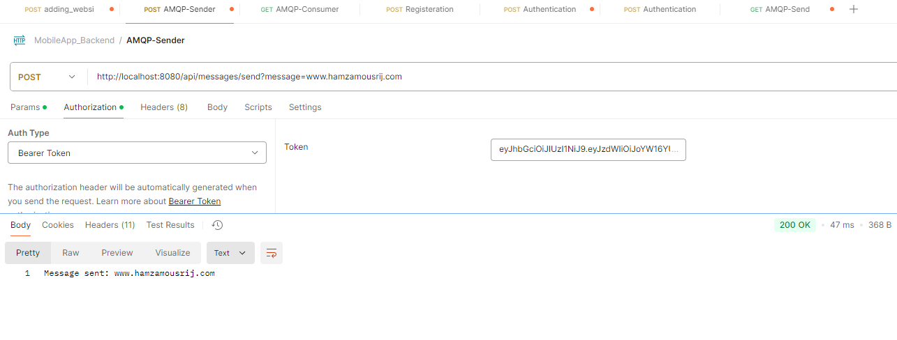</dd>
</li>
<li>
<dt>Consumme AMQP API Reader : </dt>
        <i>We have to consume the api with a jwt authentication alive token</i>
        <dd>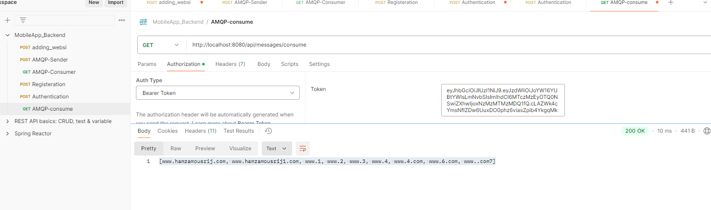</dd>
</li>
</ol>
    </dl>
    
 

<dl>
        <dt>VI-Send Website to MongoDb Document :</dt>
        <dd>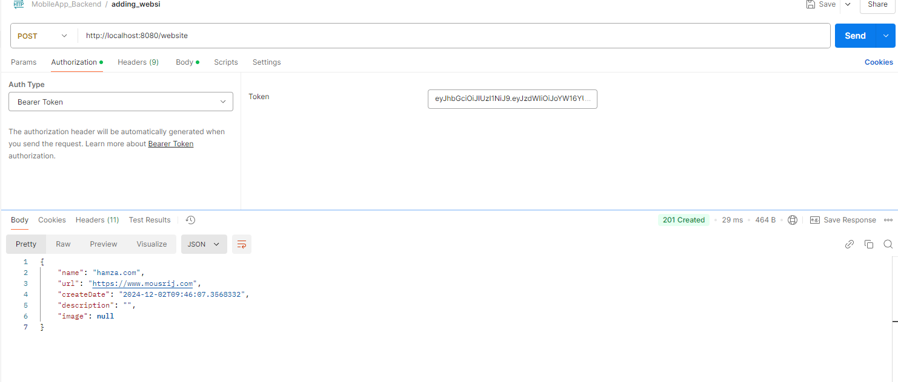</dd>
 <dl>
        <dt>V-Data Persistant</dt>
        <i>Users registered are persisted within mongoDB database</i>
        <dd>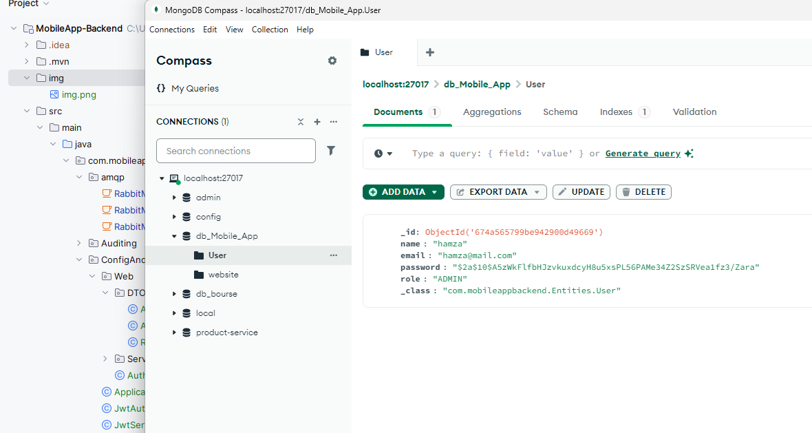</dd>
    </dl>
        
</dl>    
</dl>

